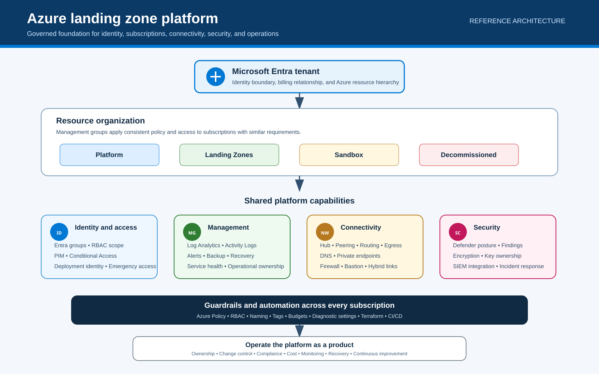
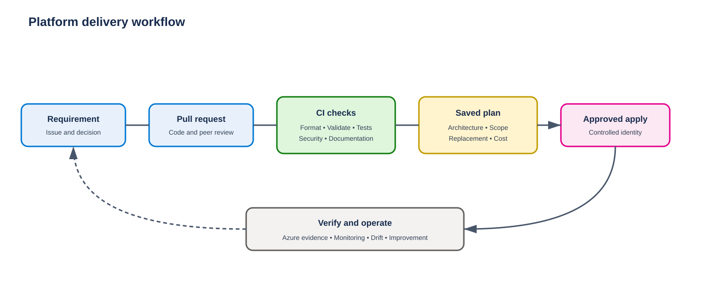
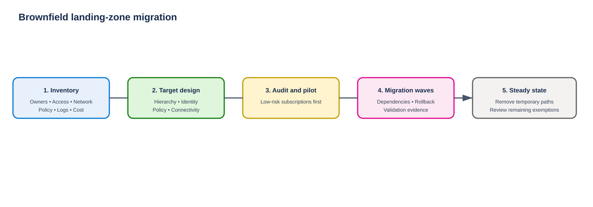

# Azure Enterprise Landing Zone

[](https://developer.hashicorp.com/terraform)
[](https://registry.terraform.io/providers/hashicorp/azurerm/latest)
[](LICENSE)
[](https://github.com/AddySidd27/Azure-Landing-Zone/actions/workflows/terraform-ci.yml)

A practical guide to designing, building, validating, and operating an Azure platform foundation with Terraform.

This repository focuses on the Azure landing zone platform: tenant decisions, management groups, subscriptions, identity, governance, networking, security, monitoring, automation, cost control, and operations. It does not deploy business workloads.

> Start with the low-cost lab. The advanced profile can create paid services such as Azure Firewall, Bastion, DNS Private Resolver, and Defender plans.

## Navigation

| I want to | Go to |
|---|---|
| Understand the landing zone | [Concept](#1-azure-landing-zone-concept) |
| See the exact repository scope | [Scope](#2-scope) |
| Follow the correct learning order | [Learning and build order](#recommended-learning-and-build-order) |
| Learn every platform capability | [Capabilities](#3-platform-capabilities) |
| Understand the design | [Architecture](#4-reference-architecture) |
| Compare lab and enterprise design | [Lab versus enterprise](#5-lab-versus-enterprise) |
| Compare this lab with the official implementation | [Official implementation path](#5a-how-this-repository-relates-to-the-official-azure-landing-zones-implementation) |
| See what Terraform creates | [Terraform coverage](#6-terraform-coverage) |
| Build the lab | [Deployment](#8-deploy-the-core-lab) |
| Confirm the result | [Validation](#9-validate-the-landing-zone) |
| Study practical scenarios | [Scenarios](#10-practical-scenarios) |
| Complete guided exercises | [Labs](#11-guided-labs) |
| Operate the platform | [Operations](#12-day-2-operations) |
| Follow complete examples | [End-to-end cases](#13-end-to-end-case-studies) |
| Open any folder | [Repository map](#14-repository-map) |
| Review official sources | [Microsoft sources](#15-verified-microsoft-sources) |

---

## 1. Azure landing zone concept

An Azure landing zone is a prepared and governed Azure environment. It gives teams a consistent place to use Azure without designing identity, subscriptions, networks, security, monitoring, and policy from the beginning every time.

It is not one Azure resource. It is not only a virtual network. It is not only a management-group hierarchy. It is the complete platform foundation and the process used to operate that foundation.

### The business problem

Without a landing zone, different teams can create Azure environments in different ways. Common results are:

- subscriptions without clear owners;
- broad access and permanent privileged roles;
- overlapping network ranges;
- inconsistent DNS and routing;
- missing logs and alerts;
- public access that was not reviewed;
- policies applied after workloads are already running;
- weak cost ownership;
- manual deployments that are difficult to repeat;
- no controlled process for onboarding or retirement.

### The landing-zone outcome

A landing zone creates a standard foundation:

1. The Microsoft Entra tenant and billing model are confirmed.
2. Management groups organize subscriptions by control requirements.
3. Platform subscriptions separate shared identity, management, connectivity, and security services.
4. Azure Policy applies guardrails at the correct scope.
5. RBAC and privileged-access processes control administration.
6. Shared network, routing, DNS, and egress patterns are defined.
7. Logs, alerts, security findings, budgets, and ownership are centralized.
8. Infrastructure as code and pipelines make changes repeatable and reviewable.
9. New subscriptions receive a standard baseline.
10. Day-2 processes manage drift, exceptions, recovery, upgrades, and retirement.

The result is faster delivery inside known controls. It is not a promise that every workload is automatically secure or reliable. Each service still needs its own design and operations.

### Five design principles

Microsoft uses five principles to guide landing-zone decisions:

1. **Subscription democratization:** use subscriptions as management boundaries and give workload teams controlled autonomy.
2. **Policy-driven governance:** apply guardrails consistently through Azure Policy, independent of the deployment tool.
3. **Single control and management plane:** use Azure Resource Manager, RBAC, and Policy as the common Azure control plane.
4. **Application-centric service model:** organize subscriptions and services around workload requirements and lifecycle.
5. **Align with Azure-native design and roadmaps:** prefer Azure-native capabilities when they meet the requirement, and plan for platform evolution.

[Microsoft source](https://learn.microsoft.com/en-us/azure/cloud-adoption-framework/ready/landing-zone/design-principles)

Microsoft reference: [What is an Azure landing zone?](https://learn.microsoft.com/en-us/azure/cloud-adoption-framework/ready/landing-zone/)

---

## 2. Scope

### In scope

| Area | What this repository covers |
|---|---|
| Tenant and billing | Tenant boundary, subscription ownership, and billing decision points |
| Resource organization | Management groups, platform subscriptions, workload subscription placement, sandbox, and decommissioned scopes |
| Identity and access | Entra groups, RBAC scope, deployment identity, PIM guidance, and emergency access |
| Governance | Azure Policy, assignment scope, audit-first rollout, remediation, and exemptions |
| Networking | Hub-and-spoke foundation, peering, routing, DNS, egress, and hybrid connectivity decisions |
| Security | Defender options, Key Vault private access, findings ownership, and security operations boundaries |
| Management | Log Analytics, Activity Logs, alerts, monitoring ownership, backup, and recovery decisions |
| Automation | Terraform state, configuration profiles, tests, CI, reviewed plans, and controlled changes |
| Cost | Tags, subscription budget, paid-service controls, and cost ownership |
| Operations | Daily checks, platform updates, policy lifecycle, troubleshooting, recovery, and decommissioning |

### Out of scope

This repository does not deploy:

- Azure Virtual Desktop host pools or session hosts;
- AKS clusters;
- web applications or databases;
- workload images, profiles, or application packages;
- production VPN or ExpressRoute circuits;
- a complete SIEM or SOC implementation;
- organization-specific Conditional Access policies;
- commercial-agreement subscription creation.

Those services can use the platform foundation, but they need separate requirements, owners, code, tests, and lifecycle management.

## Recommended learning and build order

Follow this order. Each stage creates decisions or evidence needed by the next stage.

| Stage | Learn or decide | Output before continuing |
|---:|---|---|
| 1 | Landing-zone purpose, scope, design principles, and platform boundaries | Agreed platform scope and success measures |
| 2 | Business needs, stakeholders, regions, compliance, recovery, connectivity, growth, and cost | Requirements, owners, risks, and constraints |
| 3 | Entra tenant, billing agreement, and subscription-creation authority | Approved tenant and billing ownership |
| 4 | Operating model, support, responsibilities, and change approval | Responsibility matrix and escalation path |
| 5 | Management groups, platform subscriptions, workload placement, sandbox, and retirement | Approved hierarchy and subscription register |
| 6 | Identity, RBAC, PIM, Conditional Access, emergency access, and deployment identity | Role matrix and privileged-access design |
| 7 | Policy baseline, assignment scope, remediation, exemptions, naming, tags, and cost | Governance baseline and rollout plan |
| 8 | Network topology, IP plan, routing, egress, hybrid connectivity, private access, and DNS | Approved network and DNS design |
| 9 | Security operations, monitoring, alerts, logs, backup, service health, and recovery | Security, management, and recovery plans |
| 10 | Terraform state, modules, CI/CD, reviews, deployment identity, and rollback | Protected and repeatable delivery process |
| 11 | Core deployment, optional services, and functional validation | Release evidence and accepted exceptions |
| 12 | Subscription vending and first workload handover | Governed subscription with tested controls |
| 13 | Day-2 operations, upgrades, access review, policy lifecycle, cost, recovery, and decommissioning | Operating calendar, measures, and service ownership |

Read [the detailed learning path](docs/00-start-here/learning-path.md), then use the [greenfield](docs/05-use-cases/greenfield.md) or [brownfield](docs/05-use-cases/brownfield.md) case to apply the complete process.

### Official design-area coverage

Microsoft defines eight Azure landing zone design areas. All eight are covered here.

| Microsoft design area | Repository section |
|---|---|
| Azure billing and Microsoft Entra tenant | [Tenant and billing](#31-tenant-and-billing) |
| Identity and access management | [Identity and access](#33-identity-and-access) |
| Resource organization | [Management groups and subscriptions](#32-management-groups-and-subscriptions) |
| Network topology and connectivity | [Network topology and DNS](#35-network-topology-and-dns) |
| Security | [Security](#36-security) |
| Management | [Management, monitoring, and recovery](#37-management-monitoring-and-recovery) |
| Governance | [Governance and Azure Policy](#34-governance-and-azure-policy) |
| Platform automation and DevOps | [Platform automation and DevOps](#38-platform-automation-and-devops) |

Naming, tagging, cost, business continuity, subscription vending, validation, and platform operations are also included because they are needed to turn the design areas into an operating platform. The [coverage matrix](docs/09-review/coverage-matrix.md) separates implemented Terraform, guided labs, design guidance, and operational processes.

---

## 3. Platform capabilities

Microsoft groups landing-zone decisions into design areas. The sections below explain what each capability does, why it matters, and what this repository demonstrates.

### 3.1 Tenant and billing

The Microsoft Entra tenant is the identity boundary for Azure subscriptions. The billing agreement controls how subscriptions are purchased and who can create them.

Decide:

- which tenant is the corporate tenant;
- who owns billing and subscription creation;
- which billing offer is used;
- how new subscriptions enter the tenant;
- whether subscription transfers are restricted;
- who approves production and non-production subscriptions.

This repository asks for tenant and subscription IDs but does not create a billing agreement.

#### Practical example

A company has several Entra tenants from old projects. The architecture team selects the corporate tenant as the approved home for Azure subscriptions. The finance team owns the billing agreement, and only an approved group can request new subscriptions.

#### Check the result

Use `az account show` to confirm that the selected subscription belongs to the approved tenant. Record the billing owner, subscription owner, environment, and cost center before deployment.

[Detailed guide](docs/02-design-areas/billing-and-tenant.md) · [Microsoft source](https://learn.microsoft.com/en-us/azure/cloud-adoption-framework/ready/landing-zone/design-area/azure-billing-microsoft-entra-tenant)

### 3.2 Management groups and subscriptions

Management groups organize subscriptions that need the same inherited policy and access model. Subscriptions provide boundaries for ownership, RBAC, policy, cost, quota, deployment, and lifecycle.

The reference hierarchy uses:

- an intermediate root below the tenant root;
- `Platform`, with `Identity`, `Management`, `Connectivity`, and `Security` for shared platform subscriptions;
- `Landing Zones`, with `Corp`, `Online`, and optional `Local` archetypes for governed workload subscriptions;
- `Sandbox` for controlled experiments;
- `Decommissioned` for subscriptions being retired.

An archetype is a management-group placement whose inherited Policy and RBAC assignments define a type of landing zone. A subscription receives the archetype controls by being placed below that management group.

| Archetype | Typical workload | Connectivity | Example guardrails |
|---|---|---|---|
| Corp | Internal business systems | Private or hybrid connectivity through the shared hub | Restrict public exposure, use private endpoints, central DNS, and inspected routes |
| Online | Public websites and APIs | Internet-facing or independent connectivity; a VNet is optional | Permit approved public endpoints with TLS, WAF, DDoS, logging, and exposure review |
| Local | Azure Local workloads | Organization-specific hybrid connectivity | Apply controls designed for Azure Local and connected operations |

Keep the hierarchy reasonably flat. Tailor archetypes to genuine Policy or RBAC differences. Do not create a management group for every application, team, region, or environment.

#### Practical example

Shared network services are placed in a Connectivity subscription under `Platform`. An internal payroll production subscription is placed under `Corp`; a public customer website is placed under `Online`. Each inherits the controls for its archetype. A short test is placed under `Sandbox` with a budget and expiry date.

#### Check the result

Open Management Groups in the Azure portal and confirm the hierarchy, subscription placement, inherited policy assignments, and inherited role assignments.

[Detailed guide](docs/02-design-areas/resource-organization.md) · [Microsoft source](https://learn.microsoft.com/en-us/azure/cloud-adoption-framework/ready/landing-zone/design-area/resource-org-management-groups) · [Tailoring guidance](https://learn.microsoft.com/en-us/azure/cloud-adoption-framework/ready/landing-zone/tailoring-alz)

### 3.3 Identity and access

Identity answers who can access Azure and what they can do.

Use groups instead of direct user assignments. Grant the smallest useful role at the smallest useful scope. Separate human administration from deployment identities. Use PIM for eligible privileged access where supported, protect administrators with Conditional Access, and maintain tested emergency-access accounts.

Terraform can assign Azure roles. PIM, Conditional Access, identity governance, and emergency-access processes require separate tenant-level design.

#### Practical example

The network operations group receives `Network Contributor` on the Connectivity subscription. It does not receive `Owner` at the tenant root. A platform administrator activates a privileged role through PIM only for an approved change window.

#### Check the result

Review Azure role assignments at management-group and subscription scope. Confirm group-based access, the smallest required role, PIM activation evidence, Conditional Access coverage, and tested emergency-access accounts.

[Detailed guide](docs/02-design-areas/identity-and-access.md) · [Privileged access](docs/02-design-areas/privileged-access.md) · [Microsoft source](https://learn.microsoft.com/en-us/azure/cloud-adoption-framework/ready/landing-zone/design-area/identity-access)

### 3.4 Governance and Azure Policy

Governance defines the rules that Azure resources must follow. Azure Policy can audit, deny, modify, or deploy required settings.

A safe rollout is:

1. Assign the policy in audit mode.
2. Review affected resources.
3. Fix existing noncompliance.
4. Record justified exemptions with owners and expiry dates.
5. Test deployments.
6. Introduce enforcement through change control.

This repository includes a controlled policy example. It does not claim to be a complete enterprise policy library.

Policy-driven governance layers controls through inheritance. The table below is a conceptual model; exact assignments must be selected from verified requirements and the current Azure Landing Zones Library.

| Scope | Purpose | Example policy categories |
|---|---|---|
| Intermediate root | Organization-wide baseline | Approved regions, diagnostic settings, Defender configuration, and resource restrictions |
| Platform children | Protect shared Identity, Management, Connectivity, and Security services | Network, privileged-access, public-exposure, and shared-service protections |
| Landing Zones | Workload-independent security baseline | TLS, management-port exposure, encryption, monitoring, and backup |
| Corp | Private or hybrid workload controls | Restrict public endpoints and public IPs; integrate private endpoints and central private DNS |
| Online | Controlled internet-facing services | WAF, DDoS, TLS, logging, and public-exposure controls |
| Sandbox | Isolated experimentation | Restricted connectivity, budget, ownership, and expiry controls |
| Decommissioned | Prevent continued use | Deny new resource creation while retirement completes |

`Audit` reports a condition, `Deny` blocks it, `Modify` changes supported properties, and `DeployIfNotExists` deploys a related configuration when it is missing. `Modify` and `DeployIfNotExists` remediation require an assignment identity with the permissions needed for the remediation task.

#### Practical example

The platform team assigns an allowed-locations policy in audit mode. The compliance report shows resources outside the approved regions. Owners fix valid findings, and one legacy service receives a time-limited exemption before enforcement begins.

#### Check the result

Review the assignment scope, effect, compliance result, remediation tasks, exemptions, exemption owners, and expiry dates. Test an allowed deployment and a deployment that should be blocked.

[Detailed guide](docs/02-design-areas/governance.md) · [ALZ policy model](docs/08-reference/alz-policy-model.md) · [Microsoft source](https://learn.microsoft.com/en-us/azure/cloud-adoption-framework/ready/landing-zone/design-area/governance)

### 3.5 Network topology and DNS

The network foundation defines how Azure networks connect to each other, on-premises networks, private services, and the internet.

The example uses hub and spoke:

- the hub hosts shared connectivity services;
- spokes contain workload network resources;
- peering connects the hub and spokes;
- route tables define traffic paths;
- Azure Firewall can provide centralized inspection and egress;
- DNS Private Resolver can connect Azure and on-premises DNS paths;
- private DNS zones support private endpoints;
- Bastion can provide a managed administration path.

Do not add VPN, ExpressRoute, Virtual WAN, or Firewall without documented routing, resiliency, security, scale, ownership, and cost requirements.

At scale, keep Private Link private DNS zones in the Connectivity subscription. Azure Policy can use `DeployIfNotExists` to integrate private endpoints created in workload subscriptions with the matching central zone, while DNS Private Resolver supports hybrid resolution. This is design guidance; this repository creates a Key Vault zone and optional resolver but does not deploy the complete policy set for every supported service.

#### Practical example

An internal service uses a spoke VNet. Its traffic reaches on-premises systems through the hub, and internet egress passes through Azure Firewall. Private DNS Resolver forwards approved corporate DNS queries between Azure and on-premises DNS servers.

#### Check the result

Confirm non-overlapping address spaces, connected peering, effective routes, next hop, NSG rules, firewall logs, forward and reverse DNS resolution, and both directions of the return path.

[Detailed guide](docs/02-design-areas/networking.md) · [Connectivity choices](docs/02-design-areas/connectivity-options.md) · [Microsoft source](https://learn.microsoft.com/en-us/azure/cloud-adoption-framework/ready/landing-zone/design-area/network-topology-and-connectivity) · [Private Link DNS at scale](https://learn.microsoft.com/en-us/azure/cloud-adoption-framework/ready/azure-best-practices/private-link-and-dns-integration-at-scale)

### 3.6 Security

Security is a shared responsibility. The platform team protects the tenant hierarchy and shared services. Security teams define controls and handle security operations. Resource owners remediate findings in the services they own.

Define:

- security contacts and escalation paths;
- Defender plans that are approved and funded;
- allowed public access;
- encryption and key ownership;
- vulnerability and configuration management;
- log retention and SIEM integration;
- incident response ownership.

Paid Defender plans remain empty in the examples until explicitly selected.

The current ALZ conceptual architecture includes a dedicated `Security` management group and subscription below `Platform` for security tooling such as Microsoft Sentinel. Operational logs remain in the central Log Analytics workspace in the Management subscription, while security and SIEM data can use a dedicated workspace in the Security subscription. This separation supports distinct SecOps and platform-operations RBAC, cost ownership, and retention requirements. The Security subscription is recommended for new designs but does not require every organization to move an existing working design immediately; this repository creates the management group but does not deploy Sentinel.

#### Practical example

Defender reports that a storage account allows public access. The security team owns the finding and severity model. The subscription owner changes the storage configuration, records the evidence, and closes the finding through the approved process.

#### Check the result

Review Defender coverage, recommendations, public endpoints, encryption settings, Key Vault access, security contacts, log routing, finding ownership, and the incident escalation path.

[Detailed guide](docs/02-design-areas/security.md) · [Security operations](docs/02-design-areas/security-operations.md) · [Microsoft source](https://learn.microsoft.com/en-us/azure/cloud-adoption-framework/ready/landing-zone/design-area/security) · [Security management group update](https://techcommunity.microsoft.com/blog/azuregovernanceandmanagementblog/a-new-platform-management-group--subscription-for-security-in-azure-landing-zone/4433287)

### 3.7 Management, monitoring, and recovery

Management provides visibility and operational control after deployment.

The baseline includes Log Analytics, Activity Log diagnostics, an Action Group, and operational guidance. Production design must also define log destinations, retention, alert severity, on-call ownership, backup, recovery objectives, service health, and test schedules.

Azure Monitor Baseline Alerts for Azure landing zones provides a policy-driven baseline for platform alerts. Use Azure Monitor Agent with Data Collection Rules for required VM telemetry; the legacy Log Analytics agent is retired. Configure Service Health alerts for each subscription and use Azure Update Manager for supported machine patching. These are production design recommendations and are not deployed by this repository's Terraform.

A successful Terraform apply proves that resources were created. It does not prove that alerts reach the correct team or that recovery works. Those outcomes require tests.

#### Practical example

Subscription Activity Logs are sent to the central Log Analytics workspace. A safe test event creates an alert, the Action Group notifies the platform team, and the responder follows a documented runbook.

#### Check the result

Run a log query, trigger a safe test alert, confirm the recipient and timestamp, review retention, verify backup status, and complete a recovery exercise with recorded results.

[Detailed guide](docs/02-design-areas/management.md) · [Business continuity](docs/02-design-areas/business-continuity.md) · [Microsoft source](https://learn.microsoft.com/en-us/azure/cloud-adoption-framework/ready/landing-zone/design-area/management) · [AMBA](https://learn.microsoft.com/en-us/azure/cloud-adoption-framework/ready/landing-zone/design-area/management-monitor) · [AMA and DCRs](https://learn.microsoft.com/en-us/azure/azure-monitor/agents/azure-monitor-agent-overview) · [Service Health alerts](https://learn.microsoft.com/en-us/azure/service-health/alerts-activity-log-service-notifications-portal) · [Azure Update Manager](https://learn.microsoft.com/en-us/azure/update-manager/overview)

### 3.8 Platform automation and DevOps

Automation makes the platform repeatable and reviewable.

This repository separates remote-state bootstrap from the main platform deployment. Configuration profiles keep the low-cost and advanced options visible. CI runs formatting, initialization, validation, tests, repository checks, and link checks. Production delivery should use federated identity, protected environments, approvals, saved plans, versioned modules, and rollback procedures.

#### Practical example

An engineer opens a pull request to change a network range. CI checks formatting, Terraform validation, tests, and repository quality. An approver reviews the saved plan before the protected pipeline uses federated identity to deploy the change.

#### Check the result

Confirm that state is remote and protected, secrets are not stored in the repository, the pipeline uses OIDC, required reviews are enabled, plan evidence is retained, and rollback steps are tested.

[Detailed guide](docs/02-design-areas/platform-automation-devops.md) · [Deployment identity](docs/03-implementation/deployment-identity.md) · [Microsoft source](https://learn.microsoft.com/en-us/azure/cloud-adoption-framework/ready/landing-zone/design-area/platform-automation-devops)

### 3.9 Naming, tags, and cost

Names help people and automation identify resources. Tags add business metadata such as owner, environment, service, cost center, and data classification.

Tags do not replace subscription boundaries or RBAC. Budgets send alerts; they do not stop spending. Every paid platform service needs an owner, budget, expected usage, and shutdown decision.

#### Practical example

Every platform resource records `owner`, `environment`, `service`, and `costCenter`. The Connectivity subscription has a monthly budget with notifications at agreed thresholds. Firewall cost is reviewed separately because it is a paid shared service.

#### Check the result

Find resources with missing tags, review Cost Analysis by subscription and tag, confirm budget recipients, test a budget notification, and compare actual cost with the approved estimate.

[Detailed guide](docs/02-design-areas/naming-tagging-cost.md)

### 3.10 Platform operations

The landing zone is a product, not a one-time project. It needs owners, a backlog, releases, support boundaries, documentation, change control, and measurable service health.

Operate policy versions, access, network changes, security findings, alerts, budgets, state, provider upgrades, exceptions, recovery tests, and subscription retirement.

#### Practical example

The platform team reviews failed deployments and critical alerts daily, policy drift and privileged activity weekly, access and budgets monthly, and recovery quarterly. A provider upgrade is tested in the core lab before it reaches the protected platform environment.

#### Check the result

Review the operations calendar, named owners, open risks, expired exemptions, failed alerts, recovery evidence, change records, release notes, and decommissioning records.

[Operating model](docs/01-foundations/operating-model.md) · [Day-2 guide](docs/06-operations/day-2-operations.md)

---

## 4. Reference architecture



The diagram shows one Microsoft Entra tenant with a governed hierarchy and four shared platform capabilities. The detailed [management-group diagram](docs/diagrams/svg/02-management-group-hierarchy.svg) shows `Identity`, `Management`, `Connectivity`, and `Security` below `Platform`, and `Corp`, `Online`, and `Local` below `Landing Zones`.

| Platform area | Main responsibility | Typical subscription |
|---|---|---|
| Identity | Platform identity services and privileged-access dependencies | Identity |
| Management | Logs, alerts, automation, backup, and recovery services | Management |
| Connectivity | Hub network, routing, DNS, Firewall, Bastion, VPN, and ExpressRoute | Connectivity |
| Security | Security tooling, posture visibility, and response integration | Security |

Workload subscriptions sit below governed management groups and inherit the approved policy and access model. Workload resources are outside this repository.

### Microsoft official reference architecture

The diagram below is Microsoft’s full hub-and-spoke Azure landing zone reference architecture. It contains more detail than this learning repository. Use it as the target reference; use the simplified diagram above to understand this repository's platform scope.


Source: [Azure landing zone design areas and conceptual architecture](https://learn.microsoft.com/en-us/azure/cloud-adoption-framework/ready/landing-zone/design-areas). Diagram is owned and maintained by Microsoft.

---

## 5. Lab versus enterprise

| Decision | Core lab | Enterprise target |
|---|---|---|
| Subscriptions | One existing subscription | Separate platform and workload subscriptions |
| Management groups | Disabled by default | Governed hierarchy |
| State | Remote state bootstrap | Separate protected state per platform stack |
| Network | Hub and one spoke | Requirements-based hub-spoke or Virtual WAN design |
| Firewall, Bastion, resolver | Disabled | Enabled only when approved |
| Policy | Small example | Versioned policy library and exemption process |
| Monitoring | Workspace, Activity Logs, Action Group | Full monitoring, routing, retention, SIEM, and on-call ownership |
| Identity | Current Azure context | Federated deployment identity and controlled human access |
| Delivery | Local commands and CI checks | Protected pipelines, approvals, environments, and rollback |
| Operations | Guided exercises | Platform service ownership and service-management processes |

The lab teaches the components and workflow. It is not a production topology.

---

## 5A. How this repository relates to the official Azure Landing Zones implementation

This repository is a custom, readable learning implementation. Microsoft's recommended production path is the Azure Landing Zones IaC Accelerator with Azure Verified Modules for Terraform or Bicep.

| Aspect | This repository: custom learning implementation | Official ALZ: AVM and accelerator |
|---|---|---|
| Purpose | Explain individual resources, dependencies, tests, and operating decisions | Deploy and maintain a production platform landing zone through supported patterns |
| Policy library | One controlled policy example plus design guidance | Azure Landing Zones Library with policy, archetype, role, and architecture assets |
| Management groups | Transparent Terraform resources for the reference hierarchy | `avm-ptn-alz` with the ALZ Terraform provider and library-driven architecture |
| Networking | Small hub-and-spoke example with optional shared services | AVM patterns for hub-and-spoke, Virtual WAN, gateways, and private DNS |
| Pipeline bootstrap | CI validation and documented OIDC guidance | Accelerator bootstrap for GitHub or Azure DevOps, state, identities, and pipelines |
| Upgrade path | Repository owner tests provider and code changes | Versioned AVM modules, provider, library, release notes, and migration guidance |
| Support | Independent learning repository | Microsoft-maintained open-source implementation guidance and module repositories |
| Best use | Learning, demonstrations, and low-cost design exercises | Production starting point that organizations tailor to approved requirements |

The official Terraform composition includes the ALZ core module for management groups and policy, management resources, hub-and-spoke or Virtual WAN connectivity, gateway and private DNS patterns, and the Azure Landing Zones Library processed by the ALZ Terraform provider. The accelerator prepares continuous delivery, state, identities, and pipelines. A corresponding AVM-based Bicep accelerator is also available.

The older `Azure/caf-enterprise-scale/azurerm` module has been superseded by the AVM approach and its repository reached its announced archive date. Existing users should confirm the repository's current status and follow the [official migration guidance](https://aka.ms/alz/tf/migrate) instead of starting a new deployment on the older module.

The custom implementation keeps resource relationships visible, uses small readable files, and provides a cost-controlled lab. **Use this repository to learn how each component works. For production, use the ALZ accelerator with Azure Verified Modules and tailor it.**

[Implementation options](https://learn.microsoft.com/en-us/azure/cloud-adoption-framework/ready/landing-zone/implementation-options) · [Official ALZ documentation](https://azure.github.io/Azure-Landing-Zones/) · [Azure Landing Zones Library](https://github.com/Azure/Azure-Landing-Zones-Library) · [Detailed repository guide](docs/03-implementation/avm-and-accelerator.md)

---

## 6. Terraform coverage

| Capability | Core lab | Full platform | Notes |
|---|---:|---:|---|
| Resource groups | Yes | Yes | Platform service organization |
| Hub and spoke VNets | Yes | Yes | Example address spaces |
| Subnets, NSGs, peering, routes | Yes | Yes | Network foundation |
| Log Analytics | Yes | Yes | Central workspace |
| Activity Log diagnostics | Yes | Yes | Subscription activity |
| Action Group | Yes | Yes | Alert destination example |
| Subscription budget | Yes | Yes | Alerts, not a hard spending limit |
| Management groups | No | Optional | Requires management-group permissions |
| Subscription placement | No | Optional | Moves the selected subscription |
| Azure Policy assignment | No | Optional | Controlled example |
| Azure Firewall | No | Optional | Paid service |
| Azure Bastion | No | Optional | Paid service |
| DNS Private Resolver | No | Optional | Paid service |
| Key Vault private endpoint | No | Optional | Includes private DNS integration |
| Defender plans | No | Optional | Empty until approved |

For exact resource coverage, see the [coverage matrix](docs/09-review/coverage-matrix.md).

---

## 7. Prerequisites and safety

Required:

- Git;
- Azure CLI;
- Terraform 1.13.x;
- an Azure subscription for the lab;
- permissions for the resources being deployed;
- additional tenant or management-group permissions only when those options are enabled.

Confirm the active Azure context:

```bash
az login
az account list --output table
az account set --subscription "<subscription-id>"
az account show --query "{tenantId:tenantId,subscriptionId:id,name:name}" --output table
```

Stop if the tenant or subscription is wrong.

Never commit local values, state, plans, credentials, or organization information:

```text
terraform.tfvars
*.auto.tfvars
*.tfstate
*.tfstate.*
*.tfplan
```

Files ending in `.example` contain placeholders and are safe templates.

[Full prerequisites](docs/00-start-here/prerequisites.md) · [Cost and safety](docs/03-implementation/cost-and-safety.md)

---

## 8. Deploy the core lab

### Step 1: Clone

```bash
git clone https://github.com/AddySidd27/Azure-Landing-Zone.git
cd Azure-Landing-Zone
```

### Step 2: Bootstrap remote state

```bash
cd bootstrap
cp terraform.tfvars.example terraform.tfvars
```

Update the tenant and subscription IDs, then run:

```bash
terraform init
terraform fmt -check
terraform validate
terraform plan -out=bootstrap.tfplan
terraform show bootstrap.tfplan
terraform apply bootstrap.tfplan
terraform output backend
```

### Step 3: Create the core configuration

From the repository root:

```bash
cp config/core-lab/backend.hcl.example config/core-lab/backend.hcl
cp config/core-lab/core-lab.tfvars.example config/core-lab/core-lab.auto.tfvars
```

Update the subscription ID, tenant ID, region, name prefix, address spaces, budget, and tags.

Keep these paid or high-scope features disabled for the first deployment:

```hcl
deploy_management_groups     = false
deploy_subscription_policy  = false
enable_firewall             = false
enable_bastion              = false
enable_dns_private_resolver = false
enable_key_vault            = false
defender_plans              = []
```

### Step 4: Initialize and test

```bash
cd platform
terraform init -backend-config=../config/core-lab/backend.hcl
terraform fmt -check -recursive
terraform validate
terraform test
```

### Step 5: Plan, review, and apply

```bash
terraform plan \
  -var-file=../config/core-lab/core-lab.auto.tfvars \
  -out=core-lab.tfplan

terraform show core-lab.tfplan
terraform apply core-lab.tfplan
```

Review tenant, subscription, region, address spaces, public IPs, paid services, role assignments, policy scope, replacements, and deletions before apply.

[Complete deployment guide](docs/03-implementation/deployment-guide.md)

---

## 9. Validate the landing zone

Terraform success is only the first check.

### Code checks

```bash
terraform fmt -check -recursive
terraform validate
terraform test
bash scripts/check-repository.sh
bash scripts/check-links.sh --external
```

### Azure CLI checks

```bash
terraform output

az group list \
  --query "[?tags.platform=='azure-landing-zone'].{name:name,location:location}" \
  --output table

az network vnet list \
  --query "[].{name:name,address:addressSpace.addressPrefixes}" \
  --output table

az monitor log-analytics workspace list --output table
az consumption budget list --output table
```

### Functional checks

- Confirm resource names, regions, tags, and owners.
- Confirm hub and spoke ranges do not overlap.
- Confirm peering is connected in both directions.
- Review effective routes and NSG rules.
- Test DNS resolution from the expected client path.
- Confirm Activity Logs reach the workspace.
- Trigger a safe test alert and confirm delivery.
- Review policy compliance and exemptions.
- Confirm budgets and recipients.
- Confirm no unapproved paid service is enabled.

[Portal validation](docs/03-implementation/portal-validation.md) · [Validation strategy](docs/03-implementation/validation-strategy.md)

---

## 10. Practical scenarios

| Scenario | Platform response | Required evidence |
|---|---|---|
| New Azure tenant | Define tenant, billing, hierarchy, platform subscriptions, policy, access, network, monitoring, and ownership before scale | Approved decisions, owners, hierarchy, baseline plan |
| Existing Azure estate | Inventory first, use audit policy, remediate, define exceptions, and migrate subscriptions in waves | Inventory, compliance baseline, migration plan, rollback |
| New subscription request | Collect owner, environment, cost center, region, data classification, and security needs; select Corp or Online; place the subscription; add RBAC, tags, budget, logs, and Corp hub peering when required | Approved request, archetype, placement, RBAC, budget, connectivity tests, and handover |
| Hybrid connectivity | Define CIDRs, routing, DNS authority, inspection, resiliency, VPN or ExpressRoute, and return paths | Data-flow diagram, route tests, DNS tests, owner approval |
| Central monitoring | Define logs, destinations, retention, alerts, severity, on-call ownership, and SIEM integration | Log queries, alert test, runbook, retention record |
| Policy enforcement | Start in audit, assess impact, remediate, document exemptions, test, then enforce | Compliance report, exemption register, change approval |
| Regulated boundary | Separate subscriptions or management scope only when controls materially differ | Control mapping, policy evidence, access review, log retention |
| Sandbox | Apply owner, budget, expiry, restricted connectivity, service limits, and cleanup | Expiry, budget, owner, cleanup evidence |
| Multi-region platform | Define regional dependencies and shared-service resilience without copying hierarchy unnecessarily | Dependency map, capacity, failover and recovery test |
| Decommissioning | Freeze changes, retain required data, remove access and connectivity, destroy resources, then cancel | Approval, final inventory, retained-data record, final cost |

Detailed examples: [greenfield](docs/05-use-cases/greenfield.md), [brownfield](docs/05-use-cases/brownfield.md), [subscription vending](docs/05-use-cases/subscription-vending.md), and [decommissioning](docs/05-use-cases/decommissioning.md).

---

## 11. Guided labs

Complete the labs in order.

| Lab | Exercise | Expected evidence |
|---:|---|---|
| 1 | [Bootstrap remote state](docs/04-labs/lab-01-bootstrap-state.md) | Backend output and protected state container |
| 2 | [Deploy the core platform](docs/04-labs/lab-02-deploy-core.md) | Saved plan, outputs, and resource inventory |
| 3 | [Build management groups](docs/04-labs/lab-03-management-groups.md) | Hierarchy and subscription placement |
| 4 | [Assign and review policy](docs/04-labs/lab-04-policy.md) | Assignment and compliance result |
| 5 | [Deploy optional platform services](docs/04-labs/lab-05-full-platform.md) | Firewall, Bastion, resolver, and Key Vault checks |
| 6 | [Onboard a subscription](docs/04-labs/lab-06-workload-onboarding.md) | Owner, placement, connectivity, logs, and handover |
| 7 | [Use a deployment identity](docs/04-labs/lab-07-deployment-identity.md) | Federated identity and least privilege |
| 8 | [Remediate policy](docs/04-labs/lab-08-policy-remediation.md) | Before-and-after compliance |
| 9 | [Test monitoring](docs/04-labs/lab-09-monitoring-alert.md) | Signal, alert, recipient, and response |
| 10 | [Practice platform recovery](docs/04-labs/lab-10-platform-recovery.md) | Recovery steps, dependencies, and result |

---

## 12. Day-2 operations

| Frequency | Platform activities |
|---|---|
| Daily | Service health, failed deployments, critical findings, priority alerts |
| Weekly | Policy drift, privileged activity, backup failures, network changes, cost movement |
| Monthly | Access, exemptions, budgets, ownership, patching, capacity, and open risks |
| Quarterly | Recovery tests, architecture decisions, policy versions, emergency access, and documentation |
| Every change | Plan review, security, cost, routes, DNS, replacement impact, rollback, and evidence |

Operational guides:

- [Day-2 operations](docs/06-operations/day-2-operations.md)
- [Platform update process](docs/06-operations/platform-update.md)
- [Policy exemptions](docs/06-operations/policy-exemptions.md)
- [Terraform troubleshooting](docs/07-troubleshooting/terraform.md)
- [Network troubleshooting](docs/07-troubleshooting/networking.md)
- [Policy and RBAC troubleshooting](docs/07-troubleshooting/policy-rbac.md)

### Cleanup

Destroy the platform before deleting its state:

```bash
cd platform
terraform plan -destroy \
  -var-file=../config/core-lab/core-lab.auto.tfvars \
  -out=destroy.tfplan
terraform show destroy.tfplan
terraform apply destroy.tfplan
```

After platform removal, decide whether to retain or destroy the bootstrap state resources. Locks, policy, role assignments, private endpoints, and purge protection can require additional cleanup.

---

## 13. End-to-end case studies

These cases join the individual design areas into one complete sequence. Each phase includes actions, evidence, and an exit condition.

### Case 1: Organization starting Azure from the beginning

Northwind Traders has no governed Azure platform. It must establish requirements and ownership, confirm its tenant and billing model, design identity and the hierarchy, add governance and connectivity, build security and management services, create the delivery pipeline, validate the platform, and onboard its first workload subscription.

The full case contains 12 phases from discovery to day-2 improvement, plus the exact repository walkthrough.



[Follow the complete greenfield case](docs/05-use-cases/greenfield.md)

### Case 2: Organization with an existing ungoverned Azure estate

Contoso already has 45 subscriptions with inconsistent ownership, access, policy, networking, logging, and automation. It must inventory dependencies, fix immediate risks, build the target foundation beside production, test policy in audit mode, run a low-risk pilot, migrate connectivity and subscriptions in waves, introduce enforcement gradually, stop new drift, and retire old components.

The full case contains 13 phases, evidence and exit conditions for every phase, a safe migration order, rollback controls, and an example production-subscription migration record.



[Follow the complete brownfield case](docs/05-use-cases/brownfield.md)

---

## 14. Repository map

Every maintained folder is linked below.

| Folder | Contents |
|---|---|
| [.github/workflows](.github/workflows/) | Terraform CI |
| [bootstrap](bootstrap/) | Remote-state bootstrap |
| [config](config/) | Configuration profiles |
| [config/core-lab](config/core-lab/) | Low-cost values |
| [config/full-platform](config/full-platform/) | Advanced values |
| [platform](platform/) | Main Terraform root |
| [platform/tests](platform/tests/) | Native Terraform tests |
| [scripts](scripts/) | Validation and link checks |
| [docs](docs/README.md) | Detailed documentation index |
| [docs/00-start-here](docs/00-start-here/) | Prerequisites and learning order |
| [docs/01-foundations](docs/01-foundations/) | Concepts and operating model |
| [docs/02-design-areas](docs/02-design-areas/) | Platform design decisions |
| [docs/03-implementation](docs/03-implementation/) | Deployment and validation |
| [docs/04-labs](docs/04-labs/) | Guided exercises |
| [docs/05-use-cases](docs/05-use-cases/) | Platform scenarios |
| [docs/06-operations](docs/06-operations/) | Day-2 operations |
| [docs/07-troubleshooting](docs/07-troubleshooting/) | Failure diagnosis |
| [docs/08-reference](docs/08-reference/) | Glossary and ALZ policy reference |
| [docs/09-review](docs/09-review/) | Coverage and source review |
| [docs/diagrams](docs/diagrams/README.md) | Diagram index |
| [docs/diagrams/source](docs/diagrams/source/) | Editable draw.io files |
| [docs/diagrams/svg](docs/diagrams/svg/) | GitHub-ready SVG files |
| [docs/diagrams/png](docs/diagrams/png/) | High-resolution PNG files |

---

## 15. Verified Microsoft sources

| Topic | Official source |
|---|---|
| Landing zone overview | [What is an Azure landing zone?](https://learn.microsoft.com/en-us/azure/cloud-adoption-framework/ready/landing-zone/) |
| Architecture and design areas | [Azure landing zone design areas](https://learn.microsoft.com/en-us/azure/cloud-adoption-framework/ready/landing-zone/design-areas) |
| Design principles | [Azure landing zone design principles](https://learn.microsoft.com/en-us/azure/cloud-adoption-framework/ready/landing-zone/design-principles) |
| Billing and tenant | [Azure billing offers and Microsoft Entra tenants](https://learn.microsoft.com/en-us/azure/cloud-adoption-framework/ready/landing-zone/design-area/azure-billing-microsoft-entra-tenant) |
| Identity | [Identity and access management](https://learn.microsoft.com/en-us/azure/cloud-adoption-framework/ready/landing-zone/design-area/identity-access) |
| Management groups | [Management groups](https://learn.microsoft.com/en-us/azure/cloud-adoption-framework/ready/landing-zone/design-area/resource-org-management-groups) |
| Subscriptions | [Subscription considerations](https://learn.microsoft.com/en-us/azure/cloud-adoption-framework/ready/landing-zone/design-area/resource-org-subscriptions) |
| Networking | [Network topology and connectivity](https://learn.microsoft.com/en-us/azure/cloud-adoption-framework/ready/landing-zone/design-area/network-topology-and-connectivity) |
| Security | [Security design](https://learn.microsoft.com/en-us/azure/cloud-adoption-framework/ready/landing-zone/design-area/security) |
| Management | [Management design](https://learn.microsoft.com/en-us/azure/cloud-adoption-framework/ready/landing-zone/design-area/management) |
| Governance | [Governance design](https://learn.microsoft.com/en-us/azure/cloud-adoption-framework/ready/landing-zone/design-area/governance) |
| Automation | [Platform automation and DevOps](https://learn.microsoft.com/en-us/azure/cloud-adoption-framework/ready/landing-zone/design-area/platform-automation-devops) |
| Subscription vending | [Subscription vending](https://learn.microsoft.com/en-us/azure/cloud-adoption-framework/ready/landing-zone/design-area/subscription-vending) |
| Existing environment | [Transition an existing Azure environment](https://learn.microsoft.com/en-us/azure/cloud-adoption-framework/ready/enterprise-scale/transition) |
| Implementation options | [Platform landing zone implementation options](https://learn.microsoft.com/en-us/azure/cloud-adoption-framework/ready/landing-zone/implementation-options) |
| Official project | [Azure Landing Zones GitHub](https://github.com/Azure/Azure-Landing-Zones) |

Documentation links must be rechecked for each release with `bash scripts/check-links.sh --external`. The most recent verified date is recorded in the [source review record](docs/09-review/microsoft-learn-review.md).

---

## 16. Validation status

A release is ready for use only after:

- Terraform formatting passes;
- provider initialization and schema validation pass;
- native Terraform tests pass;
- repository and local-link checks pass;
- external documentation links pass;
- draw.io and SVG files parse successfully;
- a saved Terraform plan is reviewed;
- any claimed Azure deployment has portal and CLI evidence.

GitHub Actions runs Terraform and repository checks on pushes and pull requests. An authenticated Azure plan and apply remain the responsibility of the Azure environment owner.

## Project information

- [Documentation index](docs/README.md)
- [Architecture diagrams](docs/diagrams/README.md)
- [Coverage matrix](docs/09-review/coverage-matrix.md)
- [Release checklist](docs/09-review/release-checklist.md)
- [Contributing](CONTRIBUTING.md)
- [Security policy](SECURITY.md)
- [Support](SUPPORT.md)
- [Code of conduct](CODE_OF_CONDUCT.md)
- [MIT license](LICENSE)

This is an independent learning repository. It is not an official Microsoft product or support channel.
